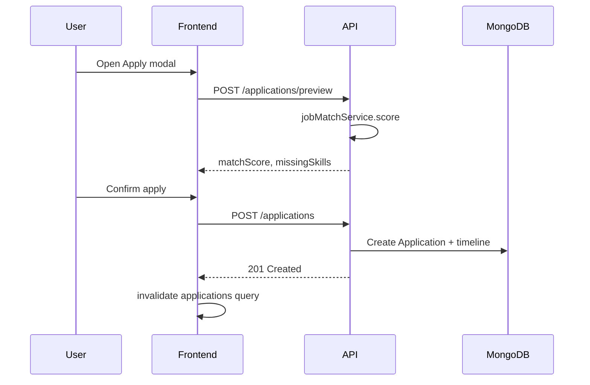

# Get.Hired — Architecture Overview

Technical architecture reference for the **get.hired+** monorepo.

---

## System context

| Actor | Interaction |
|-------|-------------|
| Job seeker | Browse, save, apply, use AI resume tools |
| Recruiter | Post jobs (`POST /api/jobs`), future analytics UI |
| Admin | Future platform management UI |
| External OAuth | Google, GitHub, LinkedIn identity providers |
| MongoDB | Persistent storage |

---

## Layered backend design

```
Routes (HTTP)
    ↓
Controllers (request/response, status codes)
    ↓
Services (business logic, scoring, parsing)
    ↓
Models (Mongoose schemas, validation)
    ↓
MongoDB
```

### Key services

| Service | File | Responsibility |
|---------|------|----------------|
| AI scoring | `aiScoringService.js` | Skill, experience, keyword, ATS, selection, growth formulas |
| Job matching | `jobMatchService.js` | Attach `ai` payload to job listings for a user |
| Resume | `resumeService.js` | Parse skills, optimize text, compute ATS breakdown |
| Messages | `messageService.js` | Template-based recruiter outreach |

### Middleware chain

1. `helmet` — security headers  
2. `cors` — origin allowlist with credentials  
3. `cookieParser` — refresh token cookie  
4. `express.json` — JSON body (5mb limit)  
5. `morgan` — request logging (dev)  
6. `rateLimit` — abuse protection  
7. `passport.initialize` — OAuth  
8. Route-level: `protect`, `authorize`, `csrf`, `upload`

---

## Frontend architecture

```
main.jsx
  └── QueryClientProvider
        └── ThemeProvider
              └── AuthProvider
                    └── BrowserRouter
                          └── App.jsx (routes)
                                └── AppLayout (shell)
                                      └── Pages
```

### State management

| Concern | Solution |
|---------|----------|
| Auth session | `AuthContext` + localStorage token |
| Theme | `ThemeContext` + `document.documentElement.classList` |
| Server data | TanStack React Query per feature |
| Forms | React Hook Form + Zod |

### Routing & authorization

- **Public:** `/login`, `/register`, `/auth/callback`, legal pages  
- **Protected:** `ProtectedRoute` wrapper requires valid session  
- **Role-gated:** Recruiter and admin pages check `user.role`

---

## AI matching engine (detailed)

### Inputs

**User:** `resumeText`, `profile.skills`, `profile.experienceYears`, `profile.education`, `atsScore`

**Job:** `requiredSkills`, `preferredSkills`, `description`, experience range, `applicantCount`, `hiringUrgency`, `companyRating`, `growthSignals`, salary range, `educationRequired`

### Score composition

```
combinedSkill = 0.5 * skillMatch + 0.3 * experienceMatch + 0.2 * keywordMatch

totalRanking =
  0.30 * skillMatch +
  0.20 * experienceMatch +
  0.20 * selectionProbability +
  0.15 * growthScore +
  0.10 * (companyRating * 20) +
  0.05 * educationMatch
```

### Recommendations strings

Rule-generated hints (missing skills, keyword mirroring, experience gaps) returned in the `ai.recommendations` array on each job.

---

## Data flow: apply with preview



---

## Deployment topology

```
                    ┌─────────────┐
                    │   Vercel    │
                    │  (Static)   │
                    └──────┬──────┘
                           │
              VITE_API_URL │
                           ▼
                    ┌─────────────┐
                    │ Render/Docker│
                    │  Express API │
                    └──────┬──────┘
                           │
                           ▼
                    ┌─────────────┐
                    │ MongoDB Atlas│
                    └─────────────┘
```

---

## Extension points

| Extension | Hook location |
|-----------|---------------|
| OpenAI completions | `backend/src/services/*.js` |
| Payments | `PremiumPage.jsx` + new billing routes |
| Real-time | WebSocket gateway + application events |
| Search scale | External index; keep Mongoose as source of truth |

---

## Related documents

- [README](../README.md)
- [FEATURES.md](FEATURES.md)
- [DEPLOYMENT.md](DEPLOYMENT.md)
